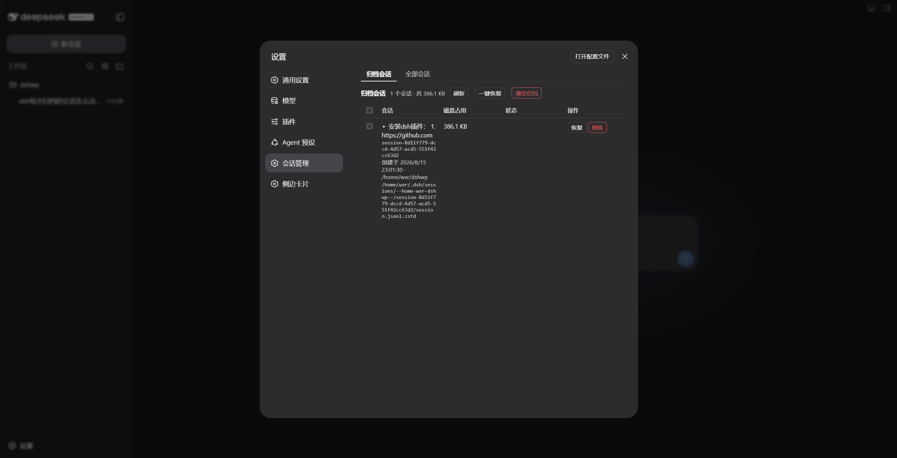

# dsh-session-manager

Session manager for [DeepSeek Harness](https://github.com/deepseek-ai/deepseek-harness).

[中文](README.zh.md) · [MIT License](LICENSE)

`dsh-session-manager` gives the Harness Web UI a full session-management surface: browse **all** sessions and the **archived** ones, restore (unarchive) archived sessions back to their original workspace, archive any session, delete sessions with a two-step confirmation, and preview conversation content — all from the Settings panel, with **zero modification to official packages**.

## What it solves

Stock DSH archives sessions one-way: the sidebar's Archive action hides a session from every view (workspace groups, ungrouped, search, flat list), and there is no view or API to bring it back — archived sessions are effectively lost until you hand-edit `~/.dsh/storages/workspace.json`. This plugin makes archiving a reversible, manageable state and adds an overview of every session on disk:

```
right-click a session -> Archive (stock DSH)
  -> the session vanishes from the sidebar (nowhere to see it again)
  -> this plugin: Settings -> Session manager -> archived tab
       preview its content, Restore it (back to its original workspace
       position), or Delete it from disk (two-step confirmation)
  -> the all-sessions tab lists every persisted session (grouped by
     workspace, ungrouped ones included) so nothing is ever lost sight of
```

## Features

- **Restore archived sessions**: an archived session keeps its workspace accounting slot, so unarchiving puts it back exactly where it was — single, batch, or all at once.
- **Delete with two-step confirmation**: the Delete button arms first and needs a second click within 5 seconds; sessions whose agent is running are rejected server-side.
- **Delete all**: clears every deletable session (archived, ungrouped, and workspace-attached alike) in one confirmed action, skipping sessions that are currently running or open, and reports per-session success / failure / skip.
- **All-sessions overview**: every session known to the persistence layer — title, id, creation time, owning workspace (or *ungrouped*), status badges (archived / live / running) — with archive and delete actions.
- **Content preview**: click a session title to expand the first 100 user / assistant / tool messages without opening the conversation.
- **Disk footprint**: per-session size and the full on-disk path help you find what is eating space.
- **Zero core modification**: a pure bundle plugin (`dsh.bundle` patch layer); every operation goes through official services (`workspaceRegistry`, `sessionPersistence`, `sessionQuery`, `fs`, `shell`, …) — no official package is patched or overridden.
- **Loopback-only API**: the `/dsh-sm/*` routes reject non-loopback hosts and cross-origin requests (Host + Origin / Sec-Fetch-Site fence).

## Installation

```sh
# one line, from a git source
dsh plugin --profile web add github:omdsh-dev/dsh-session-manager

# restart the web server, then hard-refresh the page
```

Local development:

```sh
dsh plugin --profile web add /path/to/dsh-session-manager
```

The repository ships plain-JS `lib/` artifacts with no build step, so git-source installs work without any build tooling on the user's machine.

## Usage

### Web UI



Open **Settings → Session manager**:

- **Archived** tab (default): every archived session with title, id, creation time, cwd, disk size and the full on-disk path; status badges for *running* and *missing files*. Buttons: **Restore** (single / batch / all), **Clear archive** (delete all archived, two-step), row-level **Delete** (two-step).
- **All sessions** tab: every persisted session grouped by workspace (ungrouped sessions show a `—`), status badges for *archived / live / running*. Actions: **Archive**, **Delete**, and **Delete all** (two-step; skips running/open sessions).
- Click any session title to preview its content inline (user / assistant / tool messages, first 100).

## Architecture

```
lib/
├── index.js   Host half: cordis plugin (injects webServer) exposing POST /dsh-sm/* routes
└── client.js  Browser half: __ModuleLoader__ bundle registering the Settings section
cordis.patch.yml   dsh.bundle patch layer — one insert row drives both halves
```

```
browser (Settings page) --POST /dsh-sm/*--> host handlers
   archived/list · archived/unarchive · sessions/list · sessions/archive
   · sessions/delete · sessions/detail
   workspaceRegistry (archive-set read/write) + sessionPersistence (headers/locate)
   + sessionQuery (titles/content) + fs/shell (size/delete) + agents (running guard)
```

Host routes:

| Route | Payload | Returns |
|---|---|---|
| `POST /dsh-sm/archived/list` | `{}` | `{ items, totalBytes }` |
| `POST /dsh-sm/archived/unarchive` | `{ sessionId }` | `{ ok, changed, archivedSessionIds }` |
| `POST /dsh-sm/sessions/list` | `{}` | `{ items }` |
| `POST /dsh-sm/sessions/archive` | `{ sessionId }` | `{ ok, archivedSessionIds }` |
| `POST /dsh-sm/sessions/delete` | `{ sessionId }` | `{ ok, deleted, sessionId, path?, reason? }` |
| `POST /dsh-sm/sessions/detail` | `{ sessionId }` | `{ id, createdAt, cwd, totalEvents, messageCount, truncated, messages }` |

The unarchive path rewrites the durable archive set through `workspaceRegistry.setState` (with a `workspace` storage-domain fallback), so the registry's in-memory state and the on-disk `global.archivedSessionIds` stay consistent; the client refreshes the workspace/session stores afterwards so the sidebar updates immediately.

## Testing

```sh
node test/smoke.mjs   # 10 host-logic checks against stub services
```

The smoke test drives `apply(ctx)` with stub services and covers the route wiring, the loopback/origin fence, archive-set read/write, delete bookkeeping and detail extraction. End-to-end verification was performed against a real profile (a second instance on a separate port plus a browser walkthrough of restore / archive / delete-all).

## Roadmap

- [x] Archived-session list / restore / delete (two-step)
- [x] All-sessions overview + archive any session
- [x] Delete all (skips running/open) with per-item results
- [x] Inline content preview
- [ ] Recycle bin (soft delete with undo window)
- [ ] Sidebar entry in addition to the Settings page
- [ ] npm release
